# Host Agent - ADK Orchestrator

Orchestrator agent that coordinates queries about imports and invoices using the A2A protocol.

## Architecture Diagrams

### Component Diagram


### Sequence Diagram

```mermaid
sequenceDiagram
    participant U as User
    participant HA as Host Agent
    participant VA as Verification Agent
    participant IA as Invoice Agent
    participant CA as Import Agent
    participant AI as Gemini AI

    U->>HA: Query about invoice/import
    HA->>HA: Analyze query keywords
    
    alt Invoice Query
        HA->>IA: send_message(task)
        IA->>IA: Process invoice data
        IA-->>HA: Return structured data
    else Import Query
        HA->>CA: send_message(task)
        CA->>CA: Process import info
        CA-->>HA: Return import details
    end
    
    HA->>VA: verify_response(query, response)
    VA->>AI: Analyze safety & relevance
    AI-->>VA: Verification result
    VA-->>HA: {is_safe, is_relevant, risk_level}
    
    alt Response is safe and relevant
        HA->>U: ✅ Present verified response
    else Response has issues
        HA->>U: 🚨 Show security alert
    end
```



### Data Flow Diagram


## Description

This Host Agent acts as a central orchestrator that:
- Receives user queries about imports or invoices
- Routes queries to the corresponding specialized agent
- Verifies the relevance and security of responses
- Presents responses in a structured format

## Architecture

```
User → Host Agent → Specialized Agents (A2A)
                 ↓
         ├── Imports Agent (port 8005)
         └── Invoices Agent (port 8006)
```

## Installation

1. Clone the repository
2. Create virtual environment:
   ```bash
   python -m venv .venv
   source .venv/bin/activate  # On macOS/Linux
   ```

3. Install dependencies:
   ```bash
   pip install -e .
   ```

4. Configure environment variables in `.env`:
   ```bash
   # Specialized agents
   IMPORTS_AGENT_URL=http://localhost:8005
   INVOICES_AGENT_URL=http://localhost:8006

   # Gemini model
   GEMINI_MODEL=gemini-2.0-flash-exp
   GOOGLE_API_KEY=your-api-key-here
   ```

## Running

1. **Start specialized agents first**:
   - Imports Agent on port 8005
   - Invoices Agent on port 8006

2. **Start the Host Agent**:
   ```bash
   adk web host_agent
   ```

   The server will start at http://localhost:8080

## Features

### Response Verification
- Detects dangerous or out-of-context content
- Alerts users about non-relevant responses
- Filters responses with risk content

### Smart Routing
- Analyzes keywords to determine the appropriate agent
- Handles ambiguous cases by querying both agents
- Supports partial agent name matching

### Security
- Risk keyword list to detect dangerous content
- Clear security alerts for users
- Does not display responses with inappropriate content

## Project Structure

```
host_agent/
├── __init__.py                    # Exports root_agent
├── agent.py                       # Main HostAgent class
├── remote_agent_connection.py     # A2A connection management
└── orchestration_tools.py         # Verification tools
```

## Using with ADK Web

The project is designed to work with the `adk web` command:

```bash
adk web host_agent
```

This will automatically start the ADK web server with the orchestrator agent.

## Development

To add new agents:

1. Add the new agent's URL in the `.env` file
2. Update the URL list in `agent.py`
3. Ensure the new agent implements the A2A protocol
4. Restart the Host Agent

## Troubleshooting

### Error: "Agent not found"
- Verify that specialized agents are running
- Check URLs in the `.env` file
- Review logs to see which agents were discovered

### Error: "Could not initialize HostAgent"
- May occur if an event loop is already running
- Try restarting the process

### Responses with security alerts
- The system detected potentially dangerous content
- Rephrase your query focusing on imports or invoices